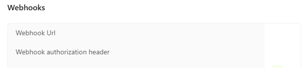
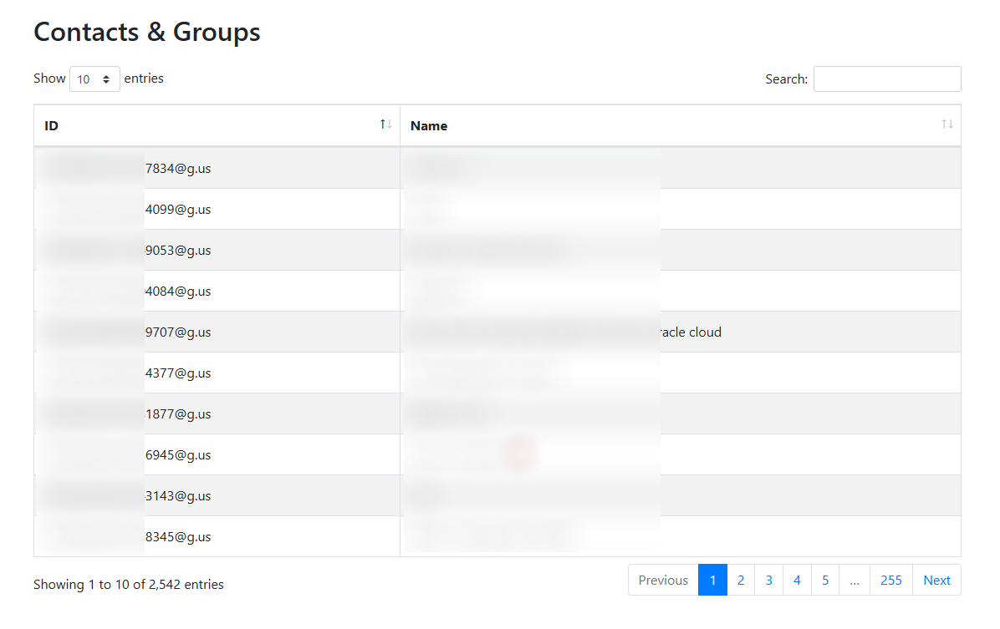

# Whatsapp Media Vault


A lightweight, Python-based WhatsApp bot powered by Green‑API that listens to your specified chats in real time and automatically saves every attachment—images, documents, audio, video, and more—to your local (or cloud) storage. Perfect for archiving media without lifting a finger.
## Components

This solution leverages the following technologies:

- **[Green-API](https://green-api.com/):** Facilitates WhatsApp communication.
- **[FastAPI](https://fastapi.tiangolo.com/):** Powers the web server interface.

## Prerequisites

Before proceeding with the setup, ensure that you have the following:

- [Docker and Docker Compose installed](https://medium.com/@tomer.klein/step-by-step-tutorial-installing-docker-and-docker-compose-on-ubuntu-a98a1b7aaed0)
- A registered [Green API Account](https://green-api.com/)


## Setup Instructions

### 1. Green API Configuration

#### Account Registration

1. Visit [https://green-api.com/en](https://green-api.com/en) and register for a new account.
2. Complete the registration form by entering your details and then click **Register**.

   
   

3. Once registered, select **Create an instance**.

   

4. Choose the **Developer** instance (Free Tier).

   

5. Copy the generated InstanceId and Token—these will be required for integration.

   

6. To link your WhatsApp account, navigate to the API section on the left under **Account** and select **QR**. Open the provided QR URL in your browser, then click on **Scan QR code**:

   
   

7. Scan the QR code to complete the linking process:

   

8. Once linked, the instance status will display a green light, indicating it is active:

   

> **Important:** Do not configure a webhook URL for your instance, as this will interfere with the bot’s functionality.
>
> 

### 2. Environment Configuration

1. Duplicate the sample environment file by running:
  ```bash
   cp .env.example .env
```

2. Edit the `.env` file with your credentials:
  ```
  # WhatsApp API Credentials
  GREEN_API_INSTANCE=your_whatsapp_instance_id
  GREEN_API_TOKEN=your_whatsapp_api_token
  ```

### 3. Running the Application

1. Use the following docker-compose.yaml :
```yaml
services:
  whatsapp-media-vault:
  container_name: whatsapp-media-vault
    image: techblog/whatsapp-media-vault:latest
    ports:
      - "7020:7020"
    environment:
      - GREEN_API_INSTANCE=${GREEN_API_INSTANCE}
      - GREEN_API_TOKEN=${GREEN_API_TOKEN}
    volumes:
      - ./whatsapp-media/vault:/app/vault
    restart: unless-stopped  
```

   Where:
   - ./whatsapp-media/vault is the volume for the saved attacments.

2. Start the application:

   ```bash
   docker-compose up -d
   ```

3. The application will be available at `http://[Server_IP]:[Port]`

## Usage

### Configuration file

Under the config folder you will find a file named *config.yaml* with the following content:

```yaml
chats:
  GroupName: 
    media_path: Path_to_save_content
    chat_ids:
      - 97200000000000011111111@g.us
      - 97200000000000011111111@c.us

```

- GroupName: The name of the group/commnity (Free text)
- media_path: The base path for saving the files (Relative, the bot will create it under the vault path.).
- chat_ids: list of whatsapp chats (Groups or Contacts) to monitor.


In order to get the list of groups, enter the following URL: http://[server_ip]:[port]/contacts

The web page will contain a table with the list of contacts and group:



> **⚠️ IMPORTANT ⚠️**: After updating the config file, restart the container to reload the configuration


The images will be saved in the following structure

```text
vault
    |──group/
          ├── image/
          │   ├── image1.jpg
          │   ├── image2.jpg
          │   └── ...
          ├── video/
          │   ├── video1.mp4
          │   └── ...
          └── documents/
              ├── doc1.doc
              └── pdf1.pdf
```


*Congrats, you can now use the bot.*
