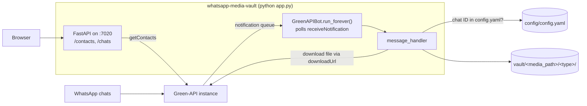

# WhatsApp Media Vault

[](LICENSE)
[](https://hub.docker.com/r/techblog/whatsapp-media-vault)

A lightweight, Python-based WhatsApp bot powered by [Green-API](https://green-api.com/) that listens to the chats you choose and saves their media attachments (images, videos, documents and audio) to a local folder, sorted by chat group and media type. It is meant for people who want to archive the photos and files shared in a family group, a class group or a project chat without saving each one by hand.

> [!WARNING]
> **Known issue in the current code:** the message handler in `app/app.py` never reads the incoming notification into the `Utils` object (`utils.get_message_data(...)` is not called), so `utils.message_type` stays `None` and **no files are saved**. The web UI and the Green-API connection work. Until this is fixed, treat the "save media" flow below as the intended behaviour. See [Troubleshooting](#troubleshooting).

## Table of contents

- [Features](#features)
- [How it works](#how-it-works)
- [Requirements](#requirements)
- [Green-API setup](#green-api-setup)
- [Installation](#installation)
- [Configuration](#configuration)
- [Usage](#usage)
- [Storage layout](#storage-layout)
- [Troubleshooting](#troubleshooting)
- [Security notes](#security-notes)
- [Privacy and legal](#privacy-and-legal)
- [Development](#development)
- [Contributing](#contributing)
- [License](#license)

## Features

- **Green-API polling bot:** receives incoming WhatsApp messages through the Green-API HTTP notification queue (no public webhook endpoint or open inbound port needed for the bot itself).
- **Per-chat allow-list:** only chats (groups or private contacts) listed in `config.yaml` are archived; everything else is ignored.
- **Grouping:** several chat IDs can share one target folder (`media_path`).
- **Media types:** `image`, `video`, `document` and `audio` messages. Text, stickers, locations, contacts, polls and other message types are ignored.
- **Sorted storage:** files land in `vault/<media_path>/<media type>/<original file name>`.
- **Contacts & Groups page:** a small web page (`/contacts`) that lists your WhatsApp contacts and groups with their chat IDs, so you can copy them into `config.yaml`.
- **Docker image:** multi-arch image on Docker Hub (`linux/amd64`, `linux/arm64`).

What it does **not** do (despite earlier wording or screenshots in this repository):

- **No cloud storage.** Files are only written to the local `vault` folder (use a mounted volume or a synced folder if you want them elsewhere).
- **No face recognition / AWS Rekognition.** There is no Rekognition code, no AWS SDK dependency and no AWS configuration. The Rekognition and "Train Model" screenshots in `screenshots/` come from a different project and are not used here.

## How it works


```mermaid
flowchart LR
    WA[WhatsApp chats] --> GA[Green-API instance]
    subgraph container["whatsapp-media-vault (python app.py)"]
        BOT["GreenAPIBot.run_forever()<br/>polls receiveNotification"]
        H[message_handler]
        WEB["FastAPI on :7020<br/>/contacts, /chats"]
    end
    GA -- notification queue --> BOT --> H
    H -- chat ID in config.yaml? --> CFG[(config/config.yaml)]
    H -- download file via downloadUrl --> GA
    H --> VAULT[(vault/&lt;media_path&gt;/&lt;type&gt;/)]
    WEB -- getContacts --> GA
    USER[Browser] --> WEB
```

1. `app.py` starts two tasks in one process: the Green-API bot (from [`whatsapp-chatbot-python`](https://github.com/green-api/whatsapp-chatbot-python)) and a FastAPI/uvicorn web server on port `7020`.
2. On startup the bot library:
   - enables incoming and outgoing message notifications on your instance **if all of them are disabled** (the library notes that settings can take up to 5 minutes to apply);
   - **deletes every notification already waiting in the queue**, so media sent while the bot was stopped is not archived.
3. The bot then polls Green-API's `receiveNotification` endpoint in a loop. Incoming messages (`incomingMessageReceived`) are passed to `message_handler`.
4. For a supported media message whose `chatId` appears in one of the `chat_ids` lists in `config.yaml`, the file is downloaded from the `downloadUrl` that Green-API provides and written to `vault/<media_path>/<type>/<fileName>`.
5. The web server's `/contacts` page calls `/chats`, which proxies Green-API's `getContacts` method and shows the result in a searchable table.

## Requirements

- A [Green-API](https://green-api.com/) account with an authorised instance (the free **Developer** instance works) and its **Instance ID** and **API token**.
- A WhatsApp account linked to that instance by QR code.
- Docker and Docker Compose ([installation guide](https://medium.com/@tomer.klein/step-by-step-tutorial-installing-docker-and-docker-compose-on-ubuntu-a98a1b7aaed0)), **or** Python 3.9+ to run from source (the Docker image uses `python:3.9-slim`).
- Outbound HTTPS access to Green-API. No inbound port is needed for the bot; port `7020` is only for the Contacts & Groups page.

No AWS account is required.

## Green-API setup

1. Visit [https://green-api.com/en](https://green-api.com/en) and register for a new account.
2. Complete the registration form by entering your details and then click **Register**.

   
   

3. Once registered, select **Create an instance**.

   

4. Choose the **Developer** instance (free tier).

   

5. Copy the generated **InstanceId** and **Token**. You will need them for the `GREEN_API_INSTANCE` and `GREEN_API_TOKEN` environment variables.

   

6. To link your WhatsApp account, go to the API section on the left under **Account** and select **QR**. Open the provided QR URL in your browser, then click **Scan QR code**:

   
   

7. Scan the QR code with WhatsApp on your phone to complete the linking process:

   

8. Once linked, the instance status shows a green light, indicating it is active:

   

> **Important:** Leave the **Webhook Url** field of your instance empty. The bot receives messages by polling Green-API's notification queue; when a webhook URL is set, Green-API delivers notifications to that URL instead and the bot receives nothing.
>
> 

## Installation

### Docker Compose (recommended)

1. Create a `.env` file from the example and fill in your credentials:

   ```bash
   cp .env.example .env
   ```

   ```dotenv
   # WhatsApp API Credentials
   GREEN_API_INSTANCE=your_whatsapp_instance_id
   GREEN_API_TOKEN=your_whatsapp_api_token
   ```

2. Create a `docker-compose.yaml`:

   ```yaml
   services:
     whatsapp-media-vault:
       container_name: whatsapp-media-vault
       image: techblog/whatsapp-media-vault:latest
       ports:
         - "7020:7020"
       environment:
         - GREEN_API_INSTANCE=${GREEN_API_INSTANCE}
         - GREEN_API_TOKEN=${GREEN_API_TOKEN}
       volumes:
         - ./whatsapp-media/vault:/app/vault
         - ./whatsapp-media/config:/app/config
       restart: unless-stopped
   ```

   - `./whatsapp-media/vault` holds the saved attachments.
   - `./whatsapp-media/config` holds `config.yaml`. On first start the app copies the default (placeholder) `config.yaml` into it if the file does not exist yet.

   > The `docker-compose.yaml` in this repository mounts only the vault and has a mis-indented `container_name:` line; use the example above.

3. Start the application:

   ```bash
   docker compose up -d
   ```

4. Edit `./whatsapp-media/config/config.yaml` (see [Configuration](#configuration)), then restart the container:

   ```bash
   docker compose restart whatsapp-media-vault
   ```

The Contacts & Groups page is available at `http://<server-ip>:7020/contacts`.

### Docker run

```bash
docker run -d --name whatsapp-media-vault \
  -p 7020:7020 \
  -e GREEN_API_INSTANCE=your_whatsapp_instance_id \
  -e GREEN_API_TOKEN=your_whatsapp_api_token \
  -v "$(pwd)/whatsapp-media/vault:/app/vault" \
  -v "$(pwd)/whatsapp-media/config:/app/config" \
  --restart unless-stopped \
  techblog/whatsapp-media-vault:latest
```

### From source

The app uses paths relative to its working directory (`config.yaml`, `config/`, `templates/`, `vault/`), so run it from inside `app/`:

```bash
git clone https://github.com/t0mer/whatsapp-media-vault.git
cd whatsapp-media-vault
python3 -m venv .venv && . .venv/bin/activate
pip install -r requirements.txt
export GREEN_API_INSTANCE=your_whatsapp_instance_id
export GREEN_API_TOKEN=your_whatsapp_api_token
cd app
python app.py
```

`config/config.yaml` and `vault/` are created under `app/` on first start.

### Published images

| Registry | Image | Tags | Platforms |
|---|---|---|---|
| Docker Hub | `techblog/whatsapp-media-vault` | `latest`, `8ca40a5` (both built 2025-04-18) | `linux/amd64`, `linux/arm64` |

There are no GitHub Releases or git tags yet. A GHCR workflow exists (see [Development](#development)), but no image has been published to `ghcr.io/t0mer/whatsapp-media-vault` so far.

## Configuration

### Environment variables

| Variable | Required | Default | Description |
|---|---|---|---|
| `GREEN_API_INSTANCE` | yes | empty | Green-API instance ID (`idInstance`). |
| `GREEN_API_TOKEN` | yes | empty | Green-API instance API token (`apiTokenInstance`). |

There are no other settings: the web server always listens on `0.0.0.0:7020`, and the contacts lookup uses `https://api.greenapi.com`. There is no command-line flag or log-level setting.

### config.yaml

The app reads `config/config.yaml` (inside the container: `/app/config/config.yaml`) **once at startup**. If it does not exist, the default `app/config.yaml` from the image is copied there.

Schema:

```yaml
chats:
  <label>:                  # free-text name for this group of chats (not used in paths)
    media_path: <folder>    # folder under vault/ where this group's media is saved
    chat_ids:               # WhatsApp chat IDs to archive into <folder>
      - <group-id>@g.us     # a group
      - <phone-number>@c.us # a private chat
```

Example with placeholders:

```yaml
chats:
  Family:
    media_path: family
    chat_ids:
      - 120363000000000000@g.us
      - 972500000000@c.us
  School:
    media_path: school/class-3
    chat_ids:
      - 120363111111111111@g.us
```

| Key | Type | Description |
|---|---|---|
| `chats` | map | One entry per archive target. |
| `chats.<label>` | map | Free-text label (group, community or person name). |
| `chats.<label>.media_path` | string | Relative folder name under `vault/`. Nested paths such as `school/class-3` are allowed. |
| `chats.<label>.chat_ids` | list of strings | Chat IDs to monitor. Groups end in `@g.us`, private chats in `@c.us`. |

If a chat ID appears under more than one label, the first matching label wins. Messages from chats that are not listed are ignored.

> **Important:** after editing `config.yaml`, restart the container (or the Python process) to reload it.

## Usage

### Find chat IDs: the Contacts & Groups page

Open `http://<server-ip>:7020/contacts`. The page loads your contacts and groups from Green-API and shows each **ID** and **Name** in a searchable, paginated table (entries without a name are hidden). Copy the IDs you want into `config.yaml`.


### HTTP endpoints

| Method | Path | Description |
|---|---|---|
| `GET` | `/contacts` | HTML page with the Contacts & Groups table. |
| `GET` | `/chats` | JSON list returned by Green-API `getContacts` (fields such as `id`, `name`, `type`), cached in memory for 60 seconds. |
| `GET` | `/docs`, `/redoc`, `/openapi.json` | FastAPI's default interactive API docs. |

None of these endpoints require authentication.

### Archiving media

Once the container is running and `config.yaml` lists your chats, every **incoming** image, video, document or audio message in those chats is downloaded into the vault (see the known issue at the top). Media you send yourself from your phone is not archived, because the bot only handles `incomingMessageReceived` notifications.

## Storage layout

Files are saved under `vault/` (inside the container: `/app/vault`), using the chat group's `media_path`, then the media type, then the original file name reported by Green-API:

```text
vault/
└── <media_path>/
    ├── image/
    │   ├── <fileName>.jpg
    │   └── ...
    ├── video/
    │   └── <fileName>.mp4
    ├── document/
    │   ├── <fileName>.pdf
    │   └── <fileName>.docx
    └── audio/
        └── <fileName>
```

- Folders are created on demand.
- Files are **not** renamed or de-duplicated: a new file with the same name in the same folder overwrites the old one.
- Storage is local only; there is no cloud upload.

## Troubleshooting

| Symptom | Cause (from the code) | What to do |
|---|---|---|
| Nothing is ever saved, no `Content saved` log lines | `message_handler` in `app/app.py` checks `utils.message_type` without first calling `utils.get_message_data(notification.event)`, so the check is always false. | Known code issue; needs a fix in `app/app.py`. |
| Media sent while the bot was down is missing | The bot library deletes all queued notifications at startup. | Expected; only media received while running is archived. |
| No notifications arrive at all | A **Webhook Url** is set on the Green-API instance, or the instance is not authorised. | Clear the webhook URL and check the instance status is green. Right after first start, allow up to 5 minutes for notification settings to apply. |
| `/contacts` shows an empty table | `/chats` failed (wrong credentials, instance not authorised, network error). The page logs the error to the browser console only. | Open `http://<server-ip>:7020/chats` to see the error and check the container logs. |
| A chat's media is not saved | Its chat ID is not in `config.yaml`, or the config was edited without a restart. | Copy the exact ID from `/contacts` and restart. |
| Container exits at startup | `config/config.yaml` contains invalid YAML, or (when running from source) the app was started outside `app/`, so the bundled default `config.yaml` can't be found. A missing `config/config.yaml` is not an error: it is recreated from the bundled default. Wrong `GREEN_API_INSTANCE` / `GREEN_API_TOKEN` values may also stop it, since the bot library queries the instance settings at startup. | Check the logs, validate the YAML, check the Green-API credentials, and run `python app.py` from inside `app/`. |
| `docker build` fails with `E: Package 'libgl1-mesa-glx' has no installation candidate` | The Dockerfile installs `libgl1-mesa-glx`, which the current `python:3.9-slim` base (Debian 13) no longer provides. This breaks local builds and both CI workflows. | Known Dockerfile issue; needs a fix in the `Dockerfile`. Use the published Docker Hub image meanwhile. |
| Download errors in the log (`Error downloading image`) | The Green-API `downloadUrl` could not be fetched or the vault folder is not writable. | Check outbound network access and the permissions of the mounted vault folder. |

## Security notes

- Keep `GREEN_API_INSTANCE` and `GREEN_API_TOKEN` in a `.env` file or a secrets store; never commit them. Anyone with these values can read and send messages as your WhatsApp account.
- The web server has **no authentication** and exposes your full contact and group list at `/contacts` and `/chats`. Do not expose port `7020` to the internet; bind it to localhost or a trusted network, or put it behind an authenticating reverse proxy. You can also drop the port mapping entirely once `config.yaml` is set up, because the bot does not need it.
- The vault holds private media. Restrict access to the mounted folder and its backups.
- Treat file names coming from chats as untrusted input.

## Privacy and legal

- This tool saves media that **other people** share in your chats. Storing and processing other people's photos, videos, voice messages and documents may be regulated (for example by data protection or privacy laws) where you live. Use it only on your own chats and with the consent of the people involved.
- If you combine the archive with other tools, note that face recognition of people involves biometric data, which many jurisdictions regulate strictly. This project does not include face recognition.
- Using unofficial WhatsApp gateways may conflict with WhatsApp's terms of service and can lead to account restrictions.
- This project is **not affiliated with, endorsed by or sponsored by WhatsApp/Meta, Green-API or AWS**. All trademarks belong to their respective owners.

## Development

### Project layout

```text
app/
├── app.py            # entry point: Green-API bot + FastAPI server (port 7020)
├── utils.py          # config loading, media type detection, download to vault/
├── confighandler.py  # unused config helper (not imported by app.py)
├── config.yaml       # default config copied to config/config.yaml on first start
└── templates/
    └── index.html    # Contacts & Groups page
Dockerfile            # python:3.9-slim, copies app/ to /app, runs python app.py
docker-compose.yaml
requirements.txt      # unpinned: fastapi, uvicorn, httpx, requests, loguru, PyYAML,
                      # pydantic, fastapi-cache2, python-multipart, whatsapp-chatbot-python
.env.example
screenshots/
```

### Build the image locally

```bash
docker build -t whatsapp-media-vault .
```

> [!WARNING]
> **The build currently fails.** `Dockerfile` lines 8-12 install `libgl1-mesa-glx`, but the current `python:3.9-slim` base image (Debian 13) no longer has that package, so the build stops with `E: Package 'libgl1-mesa-glx' has no installation candidate`. The same step breaks both CI workflows. Until the Dockerfile is fixed, use the published `techblog/whatsapp-media-vault` image or run [from source](#from-source).

The Dockerfile creates `/app/vault` and `/app/config` and does not declare `VOLUME`s or an `EXPOSE`d port; publish `7020` yourself.

### CI workflows

Both workflows run only on manual dispatch (`workflow_dispatch`):

| Workflow | File | Publishes | Tags | Platforms |
|---|---|---|---|---|
| Docker Build | `.github/workflows/docker-image.yml` | Docker Hub `techblog/whatsapp-media-vault` (login via `DOCKERHUB_USERNAME` / `DOCKERHUB_TOKEN` secrets) | `latest` and the short commit SHA (the checkout fetches no tags, so `git describe` always falls back to the SHA) | `linux/amd64`, `linux/arm64` |
| Publish to GHCR | `.github/workflows/publish-ghcr.yml` | `ghcr.io/t0mer/whatsapp-media-vault` (login via `GITHUB_TOKEN`) | the `tag` input (default `latest`) and `latest` | `linux/amd64`, `linux/arm64`, `linux/arm/v7` |

There are no tests or linters in the repository.

## Contributing

Issues and pull requests are welcome. Please keep changes focused, describe how you tested them, and never include real phone numbers, chat IDs or Green-API credentials in code, configs, logs or screenshots.

## License

Licensed under the [Apache License 2.0](LICENSE).
